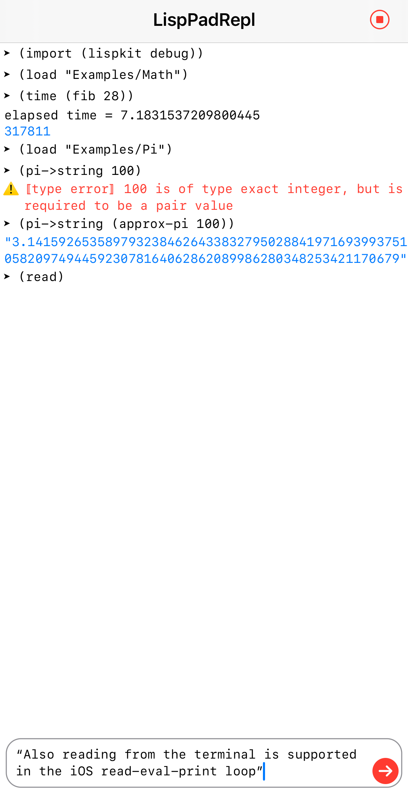

&nbsp;&nbsp; Swift LispKit
========================

[](https://developer.apple.com/osx/)
[](https://developer.apple.com/swift/)
[](https://developer.apple.com/xcode/)
[](https://github.com/Carthage/Carthage)
[](https://raw.githubusercontent.com/objecthub/swift-lispkit/master/LICENSE)


## Overview

_LispKit_ is a framework for building Lisp-based extension and scripting languages
for macOS and iOS applications. _LispKit_ is fully written in the programming language
[Swift](http://www.swift.org). _LispKit_ implements a core language based on the
[R7RS (small) Scheme standard](http://www.r7rs.org). It is extensible,
allowing the inclusion of new native libraries written in Swift, of new libraries written
in Scheme, as well as custom modifications of the core environment consisting of
a compiler, a virtual machine as well as the core libraries.

The [NumericalScheme](https://github.com/objecthub/swift-numericalscheme) demo
showcases how to create a derived _LispKit_ interpreter that inherits everything from
_LispKit_ (without code duplication) and defines a new native as well as Scheme-based library.

The iOS version of the LispKit framework is work in progress. All libraries except for
`(lispkit system os)` are supported. Library `(lispkit draw)` does not support color lists and
is generally not well tested. Generally, the differences between the macOS and iOS version of the framework
are minor, but require documentation. Interestingly, the iPhone 12 Pro (2020) seems to consistently
outperform the MacBook Pro 16" (2019) for simple LispKit benchmarks.

[_LispPad_](http://lisppad.objecthub.net) implements a simple, lightweight, integrated
development environment for _LispKit_ on macOS with a Cocoa-based UI. The
[LispPad Library Reference](http://lisppad.objecthub.net/resources/LispPad_Reference_1.5.2.pdf)
documents the core _LispPad_ and _LispKit_ libraries in
[PDF](http://lisppad.objecthub.net/resources/LispPad_Reference_1.5.2.pdf) form. There are also plans
to release an iOS version of _LispPad_. The [_LispPad for iOS_ code](https://github.com/objecthub/swift-lisppad-ios)
is available on GitHub. A much simpler command-line tool is provided by the LispKit framework itself
(see below).


## Features

_LispKit_ provides support for the following core features, many of which are based on R7RS:

  - Modules based on R7RS libraries
  - Hygienic macros based on `syntax-rules`
  - First-class environments
  - `call/cc`, `dynamic-wind` and exceptions
  - Dynamically-scoped parameters
  - Multiple return values
  - Delayed execution via promises and streams
  - Support for the full numerical tower consisting of arbitrary size integers, rationals,
    real numbers, and inexact complex numbers.
  - Unicode strings and characters
  - Vectors and bytevectors
  - Text and binary ports
  - R7RS-compliant records
  - [R6RS](http://www.r6rs.org)-compliant hashtables
  - [R6RS](http://www.r6rs.org)-compliant enumerations
  - All R7RS (small) libraries: `(scheme base)`, `(scheme case-lambda)`, `(scheme char)`, `(scheme complex)`,
    `(scheme cxr)`, `(scheme eval)`, `(scheme file)`, `(scheme inexact)`, `(scheme lazy)`,
    `(scheme load)`, `(scheme process-context)`, `(scheme read)`, `(scheme repl)`, `(scheme time)`,
    `(scheme write)`, `(scheme r5rs)`
  - Some R7RS (large) libraries from Scheme Red and Scheme Tangerine editions:
    `(scheme bitwise)`, `(scheme box)`,  `(scheme charset)`, `(scheme comparator)`, `(scheme division)`,
    `(scheme fixnum)`, `(scheme generator)`, `(scheme hash-table)`, `(scheme ideque)`, `(scheme list)`, 
    `(scheme mapping)`, `(scheme red)`, `(scheme rlist)`, `(scheme set)`,
    `(scheme sort)`, `(scheme stream)`, `(scheme text)`, `(scheme vector)`
  - LispKit-specific libraries: 
    [`(lispkit base)`](https://github.com/objecthub/swift-lispkit/wiki/LispKit-Base),
    [`(lispkit core)`](https://github.com/objecthub/swift-lispkit/wiki/LispKit-Core),
    [`(lispkit control)`](https://github.com/objecthub/swift-lispkit/wiki/LispKit-Control),
    [`(lispkit system)`](https://github.com/objecthub/swift-lispkit/wiki/LispKit-System),
    [`(lispkit system os)`](https://github.com/objecthub/swift-lispkit/wiki/LispKit-System-OS),
    [`(lispkit box)`](https://github.com/objecthub/swift-lispkit/wiki/LispKit-Box),
    [`(lispkit math)`](https://github.com/objecthub/swift-lispkit/wiki/LispKit-Math),
    [`(lispkit list)`](https://github.com/objecthub/swift-lispkit/wiki/LispKit-List),
    [`(lispkit hashtable)`](https://github.com/objecthub/swift-lispkit/wiki/LispKit-Hashtable),
    [`(lispkit dynamic)`](https://github.com/objecthub/swift-lispkit/wiki/LispKit-Dynamic),
    [`(lispkit type)`](https://github.com/objecthub/swift-lispkit/wiki/LispKit-Type),
    [`(lispkit vector)`](https://github.com/objecthub/swift-lispkit/wiki/LispKit-Vector),
    [`(lispkit gvector)`](https://github.com/objecthub/swift-lispkit/wiki/LispKit-Gvector),
    [`(lispkit record)`](https://github.com/objecthub/swift-lispkit/wiki/LispKit-Record),
    [`(lispkit bytevector)`](https://github.com/objecthub/swift-lispkit/wiki/LispKit-Bytevector),
    [`(lispkit char)`](https://github.com/objecthub/swift-lispkit/wiki/LispKit-Char),
    [`(lispkit char-set)`](https://github.com/objecthub/swift-lispkit/wiki/LispKit-Char-Set),
    [`(lispkit string)`](https://github.com/objecthub/swift-lispkit/wiki/LispKit-String),
    [`(lispkit port)`](https://github.com/objecthub/swift-lispkit/wiki/LispKit-Port),
    [`(lispkit date-time)`](https://github.com/objecthub/swift-lispkit/wiki/LispKit-Date-Time),
    [`(lispkit draw)`](https://github.com/objecthub/swift-lispkit/wiki/LispKit-Draw),
    [`(lispkit draw turtle)`](https://github.com/objecthub/swift-lispkit/wiki/LispKit-Draw-Turtle),
    [`(lispkit datatype)`](https://github.com/objecthub/swift-lispkit/wiki/LispKit-Datatype),
    [`(lispkit object)`](https://github.com/objecthub/swift-lispkit/wiki/LispKit-Object),
    [`(lispkit enum)`](https://github.com/objecthub/swift-lispkit/wiki/LispKit-Enum),
    [`(lispkit regexp)`](https://github.com/objecthub/swift-lispkit/wiki/LispKit-Regexp),
    [`(lispkit stream)`](https://github.com/objecthub/swift-lispkit/wiki/LispKit-Stream),
    `(lispkit graph)`,
    [`(lispkit match)`](https://github.com/objecthub/swift-lispkit/wiki/LispKit-Match),
    [`(lispkit iterate)`](https://github.com/objecthub/swift-lispkit/wiki/LispKit-Iterate),
    [`(lispkit log)`](https://github.com/objecthub/swift-lispkit/wiki/LispKit-Log),
    [`(lispkit debug)`](https://github.com/objecthub/swift-lispkit/wiki/LispKit-Debug),
    [`(lispkit set)`](https://github.com/objecthub/swift-lispkit/wiki/LispKit-Set),
    [`(lispkit stack)`](https://github.com/objecthub/swift-lispkit/wiki/LispKit-Stack), 
    [`(lispkit queue)`](https://github.com/objecthub/swift-lispkit/wiki/LispKit-Queue), 
    [`(lispkit heap)`](https://github.com/objecthub/swift-lispkit/wiki/LispKit-Heap),
    [`(lispkit disjoint-set)`](https://github.com/objecthub/swift-lispkit/wiki/LispKit-Disjoint-Set),
    `(lispkit wt-tree)`,
    [`(lispkit comparator)`](https://github.com/objecthub/swift-lispkit/wiki/LispKit-Comparator),
    [`(lispkit combinator)`](https://github.com/objecthub/swift-lispkit/wiki/LispKit-Combinator),
    `(lispkit logic)`,
    `(lispkit prolog)`,
    `(lispkit clos)`,
    [`(lispkit test)`](https://github.com/objecthub/swift-lispkit/wiki/LispKit-Test),
    `(lispkit prettify)`,
    [`(lispkit csv)`](https://github.com/objecthub/swift-lispkit/wiki/LispKit-CSV),
    [`(lispkit markdown)`](https://github.com/objecthub/swift-lispkit/wiki/LispKit-Markdown),
    [`(lispkit sqlite)`](https://github.com/objecthub/swift-lispkit/wiki/LispKit-SQLite),
    [`(lispkit archive zip)`](https://github.com/objecthub/swift-lispkit/wiki/LispKit-Archive-Zip),
    `(lispkit json)`,
    `(lispkit sxml)`,
    `(lispkit sxml xml)`,
    `(lispkit sxml html)`,
    and `(lispkit pdf)`.

_LispKit_ is incompatible or incomplete with respect to the following R7RS features:

  - Lists are immutable. Mutable cons-cells are supported in a way similar to
    [Racket](https://racket-lang.org)
  - Literals in `syntax-rules` are not matched based on their definition but their symbol identity
  - Datum comments introduced via `#;` do not always work as in other Scheme dialects.

The following  [SRFI](https://srfi.schemers.org/) libraries have been ported to _LispKit_ and are included in the
framework:

  - [SRFI 1: List Library](https://srfi.schemers.org/srfi-1/srfi-1.html)
  - [SRFI 2: AND-LET* - an AND with local bindings, a guarded LET* special form](https://srfi.schemers.org/srfi-2/srfi-2.html)
  - [SRFI 6: Basic String Ports](https://srfi.schemers.org/srfi-6/srfi-6.html)
  - [SRFI 8: receive - Binding to multiple values](https://srfi.schemers.org/srfi-8/srfi-8.html)
  - [SRFI 9: Defining Record Types](https://srfi.schemers.org/srfi-9/srfi-9.html)
  - [SRFI 11: Syntax for receiving multiple values](https://srfi.schemers.org/srfi-11/srfi-11.html)
  - [SRFI 14: Character-set library](https://srfi.schemers.org/srfi-14/srfi-14.html)
  - [SRFI 16: Syntax for procedures of variable arity](https://srfi.schemers.org/srfi-16/srfi-16.html)
  - [SRFI 17: Generalized set!](https://srfi.schemers.org/srfi-17/srfi-17.html)
  - [SRFI 19: Time Data Types and Procedures](https://srfi.schemers.org/srfi-19/srfi-19.html)
  - [SRFI 23: Error reporting mechanism](https://srfi.schemers.org/srfi-23/srfi-23.html)
  - [SRFI 26: Notation for Specializing Parameters without Currying](https://srfi.schemers.org/srfi-26/srfi-26.html)
  - [SRFI 27: Sources of Random Bits](https://srfi.schemers.org/srfi-27/srfi-27.html)
  - [SRFI 28: Basic Format Strings](https://srfi.schemers.org/srfi-28/srfi-28.html)
  - [SRFI 31: A special form rec for recursive evaluation](https://srfi.schemers.org/srfi-31/srfi-31.html)
  - [SRFI 33: Integer Bitwise-operation Library](https://srfi.schemers.org/srfi-33/srfi-33.html)
  - [SRFI 34: Exception Handling for Programs](https://srfi.schemers.org/srfi-34/srfi-34.html)
  - [SRFI 35: Conditions](https://srfi.schemers.org/srfi-35/srfi-35.html)
  - [SRFI 39: Parameter objects](https://srfi.schemers.org/srfi-39/srfi-39.html)
  - [SRFI 41: Streams](https://srfi.schemers.org/srfi-41/srfi-41.html)
  - [SRFI 46: Basic Syntax-rules Extensions](https://srfi.schemers.org/srfi-46/srfi-46.html)
  - [SRFI 48: Intermediate Format Strings](https://srfi.schemers.org/srfi-48/srfi-48.html)
  - [SRFI 51: Handling rest list](https://srfi.schemers.org/srfi-51/srfi-51.html)
  - [SRFI 54: Formatting](https://srfi.schemers.org/srfi-54/srfi-54.html)
  - [SRFI 55: require-extension](https://srfi.schemers.org/srfi-55/srfi-55.html)
  - [SRFI 63: Homogeneous and Heterogeneous Arrays](https://srfi.schemers.org/srfi-63/srfi-63.html)
  - [SRFI 64: A Scheme API for test suites](https://srfi.schemers.org/srfi-64/srfi-64.html)
  - [SRFI 69: Basic hash tables](https://srfi.schemers.org/srfi-69/srfi-69.html)
  - [SRFI 87: `=>` in case clauses](https://srfi.schemers.org/srfi-87/srfi-87.html)
  - [SRFI 95: Sorting and Merging](https://srfi.schemers.org/srfi-95/srfi-95.html)
  - [SRFI 98: An interface to access environment variables](https://srfi.schemers.org/srfi-98/srfi-98.html)
  - [SRFI 101: Purely Functional Random-Access Pairs and Lists](https://srfi.schemers.org/srfi-101/srfi-101.html)
  - [SRFI 111: Boxes](https://srfi.schemers.org/srfi-111/srfi-111.html)
  - [SRFI 112: Environment inquiry](https://srfi.schemers.org/srfi-112/srfi-112.html)
  - [SRFI 113: Sets and bags](https://srfi.schemers.org/srfi-113/srfi-113.html)
  - [SRFI 121: Generators](https://srfi.schemers.org/srfi-121/srfi-121.html)
  - [SRFI 125: Intermediate hash tables](https://srfi.schemers.org/srfi-125/srfi-125.html)
  - [SRFI 128: Comparators](https://srfi.schemers.org/srfi-128/srfi-128.html)
  - [SRFI 129: Titlecase procedures](https://srfi.schemers.org/srfi-129/srfi-129.html)
  - [SRFI 132: Sort Libraries](https://srfi.schemers.org/srfi-132/srfi-132.html)
  - [SRFI 133: Vector Library](https://srfi.schemers.org/srfi-133/srfi-133.html)
  - [SRFI 134: Immutable Deques](https://srfi.schemers.org/srfi-134/srfi-134.html)
  - [SRFI 135: Immutable Texts](https://srfi.schemers.org/srfi-135/srfi-135.html)
  - [SRFI 137: Minimal Unique Types](https://srfi.schemers.org/srfi-137/srfi-137.html)
  - [SRFI 142: Bitwise Operations](https://srfi.schemers.org/srfi-142/srfi-142.html)
  - [SRFI 143: Fixnums](https://srfi.schemers.org/srfi-143/srfi-143.html)
  - [SRFI 145: Assumptions](https://srfi.schemers.org/srfi-145/srfi-145.html)
  - [SRFI 146: Mappings](https://srfi.schemers.org/srfi-146/srfi-146.html)
  - [SRFI 151: Bitwise Operations](https://srfi.schemers.org/srfi-151/srfi-151.html)
  - [SRFI 152: String Library](https://srfi.schemers.org/srfi-152/srfi-152.html)
  - [SRFI 154: First-class dynamic extents](https://srfi.schemers.org/srfi-154/srfi-154.html)
  - [SRFI 155: Promises](https://srfi.schemers.org/srfi-155/srfi-155.html)  
  - [SRFI 158: Generators and Accumulators](https://srfi.schemers.org/srfi-158/srfi-158.html)
  - [SRFI 161: Unifiable Boxes](https://srfi.schemers.org/srfi-161/srfi-161.html)
  - [SRFI 162: Comparators sublibrary](https://srfi.schemers.org/srfi-162/srfi-162.html)  
  - [SRFI 165: The Environment Monad](https://srfi.schemers.org/srfi-165/srfi-165.html)
  - [SRFI 167: Ordered Key Value Store](https://srfi.schemers.org/srfi-167/srfi-167.html)
  - [SRFI 173: Hooks](https://srfi.schemers.org/srfi-173/srfi-173.html)
  - [SRFI 174: POSIX Timespecs](https://srfi.schemers.org/srfi-174/srfi-174.html)
  - [SRFI 175: ASCII Character Library](https://srfi.schemers.org/srfi-175/srfi-175.html)
  - [SRFI 177: Portable keyword arguments](https://srfi.schemers.org/srfi-177/srfi-177.html)
  - [SRFI 180: JSON](https://srfi.schemers.org/srfi-180/srfi-180.html)
  - [SRFI 189: Maybe and Either: optional container types](https://srfi.schemers.org/srfi-189/srfi-189.html)
  - [SRFI 194: Random data generators](https://srfi.schemers.org/srfi-194/srfi-194.html)
  - [SRFI 195: Multiple-value boxes](https://srfi.schemers.org/srfi-195/srfi-195.html)
  - [SRFI 196: Range Objects](https://srfi.schemers.org/srfi-196/srfi-196.html)
  - [SRFI 204: Wright-Cartwright-Shinn Pattern Matcher](https://srfi.schemers.org/srfi-204/srfi-204.html)
  - [SRFI 209: Enums and Enum Sets](https://srfi.schemers.org/srfi-209/srfi-209.html)
  - [SRFI 210: Procedures and Syntax for Multiple Values](https://srfi.schemers.org/srfi-210/srfi-210.html)
  - [SRFI 214: Flexvectors](https://srfi.schemers.org/srfi-214/srfi-214.html)
  - [SRFI 219: Define higher-order lambda](https://srfi.schemers.org/srfi-219/srfi-219.html)


## Project

The project defines four different targets:

- __LispKit__: the core interpreter framework, including all support files, for macOS
- __LispKit iOS__: the core interpreter framework, including all support files, for iOS
- __LispKitTools__: a framework for tools supporting _LispKit_; e.g. a read-eval-print framework for macOS
- __LispKitRepl__: a command-line tool implementing a read-eval-print loop for macOS


## Architecture

_LispKit_ consists of:

1. a compiler translating _LispKit_ expressions into bytecode,
2. a virtual machine for interpreting the generated bytecode. The virtual machine is
stack-based, handles tail calls and continuations, and provides a garbage collector,
3. a large range of libraries, all packaged together with the framework, and
4. a simple read-eval-print loop for macOS and iOS.

Details can be found in the [LispKit Wiki](https://github.com/objecthub/swift-lispkit/wiki).


## Command-line tool

### Overview

This project includes a command-line tool, called the _LispKit Shell_, for executing LispKit applications
in the terminal. It can be used to try out and experiment with the LispKit framework. The command-line
tool can also be used interactively as a read-eval-print loop. The read-eval-print loop parses the entered
_LispKit_ expression, compiles it to bytecode, executes it, and displays the result.

### Downloading the source code

First, clone the _LispKit_ repository via `git`. The following command will create a directory `swift-lispkit`.

```sh
> git clone https://github.com/objecthub/swift-lispkit.git
Cloning into 'swift-lispkit'...
remote: Enumerating objects: 7020, done.
remote: Counting objects: 100% (365/365), done.
remote: Compressing objects: 100% (349/349), done.
remote: Total 7020 (delta 174), reused 201 (delta 10), pack-reused 6655
Receiving objects: 100% (7020/7020), 11.29 MiB | 5.20 MiB/s, done.
Resolving deltas: 100% (4853/4853), done.
```

Next, switch to Xcode and build the _LispKit_ command-line tool via scheme `LispKitRepl`:

```sh
> open LispKit.xcodeproj
```

### Compiling the command-line tool with the Swift Package Manager

A debug binary can be built in the following way:

```sh
> cd swift-lispkit
> swift build -Xswiftc "-D" -Xswiftc "SPM"
Fetching https://github.com/objecthub/swift-markdownkit.git from cache
Fetching https://github.com/objecthub/swift-numberkit.git from cache
Fetching https://github.com/objecthub/swift-sqliteexpress.git from cache
Fetching https://github.com/objecthub/swift-commandlinekit.git from cache
Fetching https://github.com/weichsel/ZIPFoundation.git from cache
Cloning https://github.com/objecthub/swift-sqliteexpress.git
Resolving https://github.com/objecthub/swift-sqliteexpress.git at 1.0.3
Cloning https://github.com/weichsel/ZIPFoundation.git
Resolving https://github.com/weichsel/ZIPFoundation.git at 0.9.12
Cloning https://github.com/objecthub/swift-markdownkit.git
Resolving https://github.com/objecthub/swift-markdownkit.git at 1.0.5
Cloning https://github.com/objecthub/swift-numberkit.git
Resolving https://github.com/objecthub/swift-numberkit.git at 2.3.9
Cloning https://github.com/objecthub/swift-commandlinekit.git
Resolving https://github.com/objecthub/swift-commandlinekit.git at 0.3.3
[180/180] Linking LispKitRepl
```

The debug binary can now be run like this:

```sh
`.build/debug/LispKitRepl -r Sources/LispKit/Resources -d LispKit`
```

For experimentation with a new resources directory (e.g. containing new or modified Scheme libraries),
the binary can also be run via  `.build/debug/LispKitRepl -d LispKit` assuming that directory
`~/Documents/LispKit` contains a copy of the
[resources directory](https://github.com/objecthub/swift-lispkit/tree/master/Sources/LispKit/Resources).

There is also a `Makefile` which provides convenience build rules. Building and running the REPL can
be achieved, e.g. by invoking `make run` (for the debug REPL) or `make repl` (for the release REPL).
Details for building such release binaries can be looked up in the
[Makefile](https://github.com/objecthub/swift-lispkit/blob/master/Makefile).

### Building and running the iOS tool



Within Xcode, switch the scheme to the target _LispKitRepl iOS_ and build and run the project. By default,
this will invoke the iOS simulator and run an application "LispKitRepl iOS". The application has a chat-inspired
UI in which Scheme commands can be entered at the bottom and sent to the interpreter via the "arrow-up"
button. The interpreter will then execute the command and print the result in the console area above.
There is a single button with a trash can in the toolbar for resetting the interpreter. This button turns into a
button for cancelling running programs (e.g. if there is an infinite loop or other deadlock).

There is also a more advanced
[open-source iOS application called _LispPad_](https://github.com/objecthub/swift-lisppad-ioshttps://github.com/objecthub/swift-lisppad-ios)
which will eventually be available from the app store.


## Requirements

The following technologies are needed to build the components of the LispKit framework. For building the
command-line tool, all that is needed is the Swift Package Manager. For compiling the framework and trying
the command-line tool directly in Xcode, the Swift Package Manager is not needed.

- [Swift 5.4](https://developer.apple.com/swift/)
- [Xcode 12.5](https://developer.apple.com/xcode/)
- [Swift Package Manager](https://swift.org/package-manager/)
- [NumberKit](http://github.com/objecthub/swift-numberkit)
- [MarkdownKit](http://github.com/objecthub/swift-markdownkit)
- [CommandLineKit](http://github.com/objecthub/swift-commandlinekit)
- [SQLiteExpress](http://github.com/objecthub/swift-sqliteexpress)
- [ZIPFoundation](https://github.com/weichsel/ZIPFoundation)
